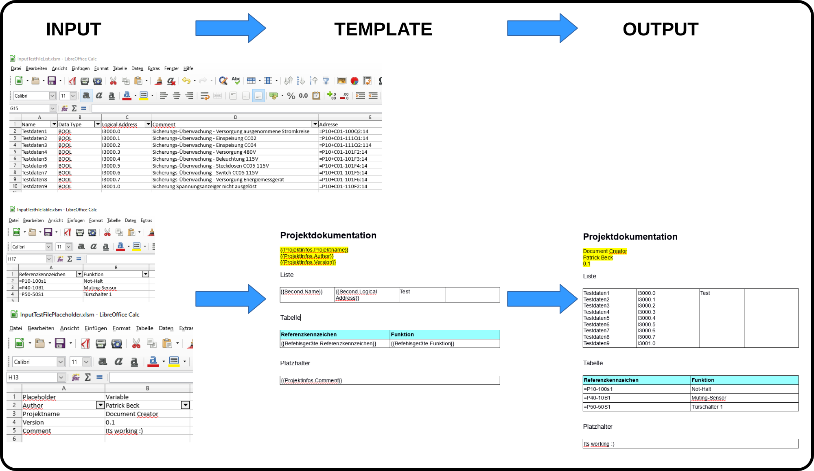

# Übersicht

DocumentCreator füllt mithilfe von Parametern bzw. Excel-Dateien Word- und Excel-Vorlagen-Dateien. Backend ist MiniWord bzw MiniExcel. 
Das System arbeitet mit Platzhaltern. Die Platzhalter werden über die Kommandozeile übergeben bzw. über die Kopfzeile der Einlesedatei automatisch generiert.

Bsp. Parameter -n setzt für die erste Datei "Devices" fest und in der Kopfzeile steht "Name". Der Tag heißt dann "{{Devices.Name}}"

Bei der Übergabe von einzelnen Parameter wird der Platzhalter direkt definiert z. B. {{Projektnr}}. 

# Ausgabe von Hilfe

	DocumentCreator 1.0.0
	Patrick Beck

	ERROR(S):
	  Required option 'i, input' is missing.
	  Required option 'm, inputmode' is missing.
	  Required option 'n, inputname' is missing.
	  Required option 'p, placeholder' is missing.
	  Required option 'v, variables' is missing.
	  Required option 't, template' is missing.
	  Required option 'o, output' is missing.

	  -i, --input          Required. Set input file(s) for variables if no commandline parameters are specified. More than
						   one input file are separated by space.

	  -m, --inputmode      Required. Set input file(s) insert mode. Can be placeholder (p), list (l) or table (t). Has to be selected for every input file. For example 'p p p' for three files or 't' for one file

	  -n, --inputname      Required. For every file a variable name can be selected. The data access pattern is
						   {{InputName.ColumnName}} in the Word file

	  -t, --template       Required. Set template file for file creation

	  -o, --output         Required. Set output file

	  -p, --placeholder    Required. If no input file is specified placeholder and variables can be passed by command line
						   interface. Placeholder and variables has to be the same size. Separated by space. Insert mode
						   placeholder.

	  -v, --variables      Required. If no input file is specified placeholder and variables can be passed by command line
						   interface. Placeholder and variables has to be the same size. Separated by space. Inset mode
						   placeholder.

	  --help               Display this help screen.

	  --version            Display version information.

# Beispiele

## Mehrere Dateien einlesen mit unterschiedlichen Einlesemodie

	-t Testdatei.docx -o output.docx -i InputTestFileList.xlsm InputTestFileTable.xlsm InputTestFilePlaceholder.xlsm  -m l t p -n Second Befehlsgeräte Projektinfos

## Platzhalter über die Kommandozeile übergeben

### Ein Parameter

	-t Arbeitsplan.docx -o output.docx -p Projektnr -v 1111

In der Datei wird der Platzhalter {{Projektnr}} durch "111" ersetzt
	
### Mehrere Parameter
	-t "Protocol.docx" -o output.docx -p Kunde Projektnr Anlage Anlagennr Station BG -v "Big Customer" 1111 Maschine#1 "Line 1" "Station 1" B9999999
	
## Excel Datei schreiben

	-t Trennblätter.xlsx -o output.xlsx -i InputTestStruktur.xlsm -m t -n Struktur